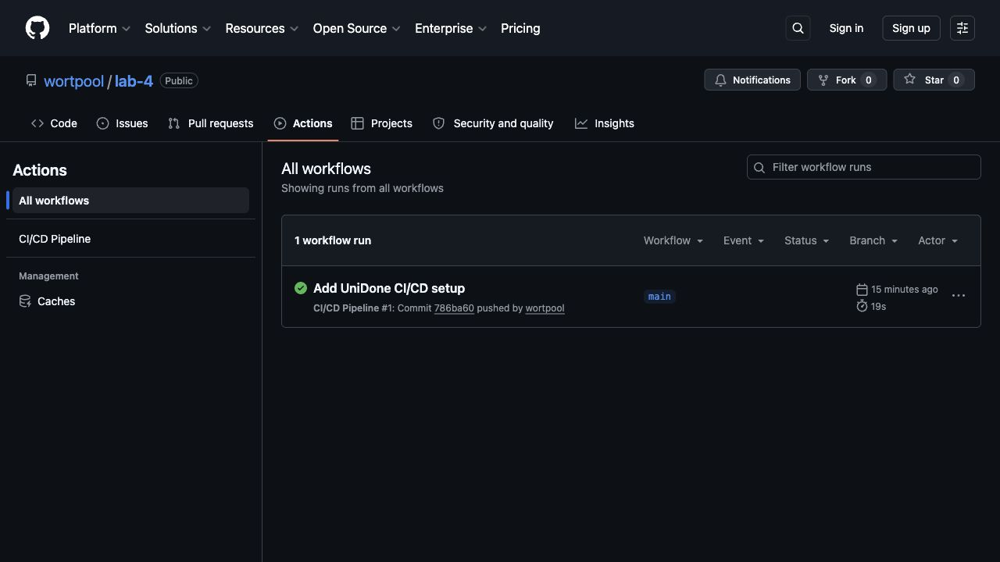
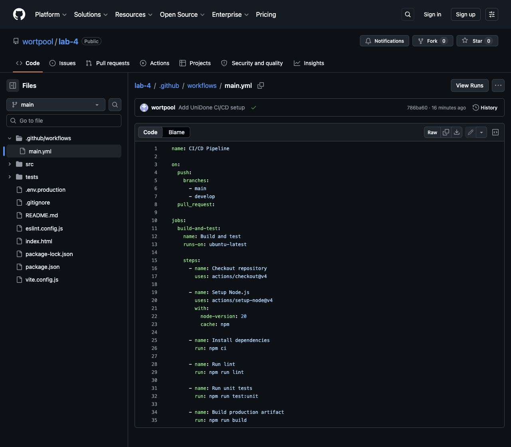
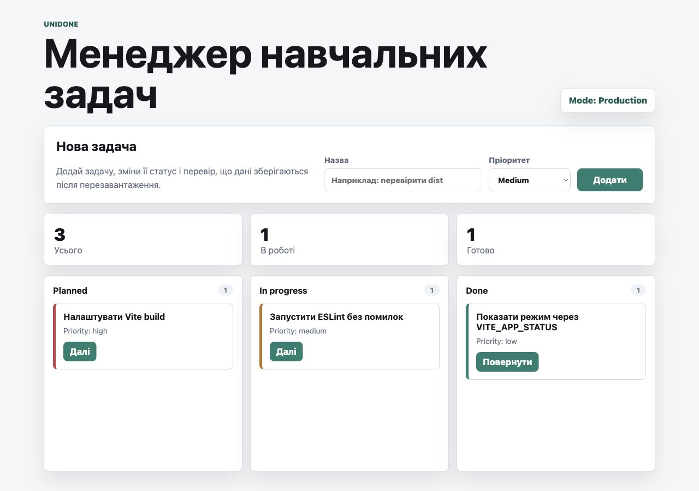

# Звіт до лабораторної роботи №4

## Тема

Безперервна інтеграція та автоматизація розгортання (CI/CD).

## Мета роботи

Налаштувати pipeline as code для frontend MVP **UniDone**, автоматизувати перевірку якості коду, запуск unit-тестів, production build і розгортання застосунку у Vercel.

## Репозиторій і production

- GitHub repository: https://github.com/wortpool/lab-4
- Production URL: https://app-six-xi-33.vercel.app
- Status badge додано у верхню частину `README.md`.

## Виконані завдання

1. Створено workflow `.github/workflows/main.yml`.
2. Налаштовано запуск workflow при `push` у `main`/`develop` та при `pull_request`.
3. Додано job `build-and-test` на `ubuntu-latest`.
4. Налаштовано Node.js 20 через `actions/setup-node@v4`.
5. Додано встановлення залежностей через `npm ci`.
6. Додано перевірку коду через `npm run lint`.
7. Додано unit-тести через `npm run test:unit`.
8. Додано production build через `npm run build`.
9. Підключено GitHub repository `wortpool/lab-4` до Vercel project.
10. Виконано production deploy UniDone на Vercel.

## Локальна перевірка

Перед пушем у GitHub локально виконано:

```bash
npm run lint
npm run test:unit
npm run build
```

Усі команди завершилися успішно.

## Скриншот GitHub Actions

На вкладці Actions видно успішний запуск workflow `CI/CD Pipeline`.



## Скриншот YAML-файлу

Файл `.github/workflows/main.yml` описує pipeline:

- `on.push.branches` запускає pipeline при push у `main` та `develop`.
- `pull_request` запускає pipeline для перевірки змін перед merge.
- `actions/checkout@v4` завантажує код репозиторію на runner.
- `actions/setup-node@v4` встановлює Node.js 20 і вмикає npm cache.
- `npm ci` встановлює залежності з `package-lock.json`.
- `npm run lint` перевіряє якість коду.
- `npm run test:unit` запускає unit-тести.
- `npm run build` перевіряє, що Vite production build збирається без помилок.



## Production deploy

Застосунок розгорнуто у Vercel. Публічний production alias:

https://app-six-xi-33.vercel.app



Vercel project розпізнано як Vite project. Build command: `npm run build` або `vite build`.

## Quality Gate

Workflow `build-and-test` успішно проходить у GitHub Actions. Для повного виконання quality gate у GitHub потрібно вручну увімкнути Branch Protection Rule:

1. GitHub repository -> Settings -> Branches.
2. Add branch protection rule.
3. Branch name pattern: `main`.
4. Увімкнути `Require status checks to pass before merging`.
5. Обрати check `Build and test`.
6. Зберегти rule.

Цей пункт не було виконано автоматично, бо в середовищі немає `gh` CLI, браузер відкрив GitHub без авторизованої сесії, а спроба використати GitHub credential для API була заблокована системою безпеки.

## Секрети

У цьому MVP секрети не потрібні. Якщо в майбутньому знадобиться `VERCEL_TOKEN`, `DATABASE_PASSWORD` або інший секрет, його треба додавати через GitHub: Settings -> Secrets and variables -> Actions -> New repository secret. У код і Git секрети додавати не можна.

## Контрольні запитання

1. `on: push` запускає workflow після відправлення комітів у вибрану гілку. `on: pull_request` запускає workflow для змін у pull request до merge.
2. `npm run build` важливо виконувати в CI/CD, бо він перевіряє, що production-артефакт збирається у чистому середовищі. Папку `dist/` не треба комітити, бо це згенерований результат, який можна відтворити.
3. Секрети репозиторію - це API-ключі, токени й паролі, які GitHub зберігає зашифровано та передає в workflow як environment variables. Їх не можна додавати у Git, бо репозиторій може бути відкритий або доступний іншим людям.
4. Автоматизація деплою зменшує Time to Market, бо кожна перевірена зміна швидко доходить до production без ручного копіювання файлів і повторюваних операцій.
